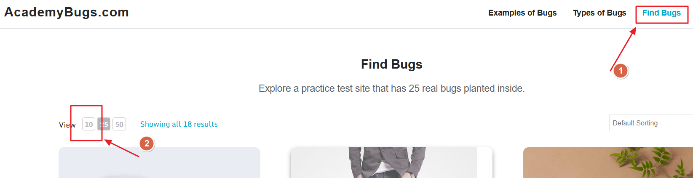

# Bug Reports 

Test environment: https://academybugs.com/find-bugs/

Below you can find some bug reports which I have encountered during exploratory testing

# BU-1: Functionality to display a specific number of products on the page does not work

| Field                | Description                                                                                      |
|----------------------|--------------------------------------------------------------------------------------------------|
| **Bug ID**           | BU-1                                                                                             |
| **Title**            | Functionality to display a specific number of products on the page does not work                 |
| **Severity**         | High                                                                                             |
| **Issue type**       | Crash                                                                                            |
| **Description**      | After navigating to the main page and clicking on any filter label to display a certain number of products on the page, the page crashes suddenly. Additionally, the functionality does not work. |
| **Environment**      | - **URL:** [academybugs.com](http://academybugs.com)   - **Browser:** [Firefox 127.0.2 (64 bity)]   - **Operating System:** [Microsoft Windows 11 Home]|
| **Steps to reproduce** | 1. Open [academybugs.com](http://academybugs.com)   2. Click the "Find Bugs" on the navigation bar   3. Click on the button to show a certain number of results at the top left |
| **Expected result**  | The selected number of results should be displayed according to the clicked buttons.              |
| **Actual result**    | The page freezes when clicking on the number of results. Functionality does not work.             |
| **Attachments**      | [BU-1.mp4](images/bugreports/BU-1.mp4)                                                            |
|                      |                                                     |

# BU-2: Loader Icon Not Vertically Centered Relative to the Label "Adding to Cart"

| Field                | Description                                                                                      |
|----------------------|--------------------------------------------------------------------------------------------------|
| **Bug ID**           | BU-2                                                                                             |
| **Title**            | Loader icon is not vertically centered relative to the Label "Add to cart"                       |
| **Severity**         | Medium                                                                                           |
| **Issue type**       | UI/Visual                                                                                       |
| **Description**      | After clicking the "Add to Cart" button the loader icon briefly appears, it is not vertically centered in relation to the label "Add to cart". |
| **Environment**      | - **URL:** [academybugs.com](http://academybugs.com)   - **Browser:** [Firefox 127.0.2 (64 bity)]   - **Operating System:** [Microsoft Windows 11 Home] |
| **Steps to reproduce** | 1. Open [academybugs.com](http://academybugs.com).   2. Click the "Find Bugs" link in the navigation bar.   3. Click the "Add to cart" button. |
| **Expected result**  | The loader icon should appear vertically centered in relation to the label "Add to cart".    |
| **Actual result**    | The loader icon is not vertically centered; it appears incorrected with the label.               |
| **Attachments**      |  [BU-2.mp4](images/bugreports/BU-2.mp4)     |

