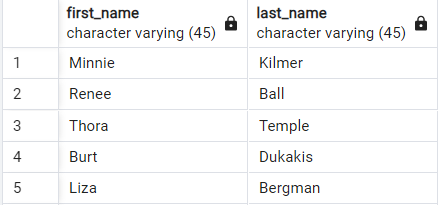

# SQL Learning

1️⃣ [SQL Basics](#sql-basics)

2️⃣ [SQL Advanced](#sql-advanced)


# SQL Basics

1. Wyświetl z tabeli customers kraje bez duplikatów, uporządkuj w kolejności alfabetycznej malejaco, wyświetl tylko 6 pierwszych wyników. 

```sql
SELECT DISTINCT country FROM `customers` ORDER BY Country DESC LIMIT 6; 
```


2. Wyświetl z tabeli Customers takie kontakty, których ContactName zaczyna się od dowolnej literki, druga to "a", trzecia "r"i ma kończyć się na "s". Wyswietl tylko nazwisko i Id klienta. 

```sql
SELECT ContactName, CustomerID FROM customers WHERE ContactName LIKE '_ar%s'; 
```


 3. Dla tabeli customers stwórz zapytanie, które wyświetli wszystkie osoby mieszkające w Madrycie lub we Francji. 

```sql
SELECT * FROM `customers` WHERE City = "Madrid" OR Country = "France"; 
```


4. Dla tabeli Orders zrób zapytanie, które wyświietli tylko 2 pierwsze rekordy należące do przedziału dat: 
od 1996-07-15 do 1996-07-30. Posortuj wyniki rosnąco po kolumnie ShipperId i malejąco po OrderId. 

```sql
SELECT * FROM `orders`WHERE OrderDate BETWEEN '1996-07-15' AND '1996-07-30' ORDER BY ShipperID ASC, OrderID DESC LIMIT 2; 
```


5. Dla klienta o Id=5 zaktualizuj miasto i kraj na odpowiednio Warszawa, Polska. 

```sql
UPDATE customers SET City = "Warsaw", Country = "Poland"
WHERE CustomerID = 5;
```


6.  Zrób zestawienie łącznej ilości osób dla konkretnej narodowości. Wyświetl tylko te rekordy gdzie łączna ilość osób w kraju > 2. Możesz wyświetlić rekordy malejąco. 

```sql
SELECT CustomerID, COUNT(CustomerName) AS IloscOsob, Country  FROM customers
GROUP By Country
HAVING COUNT(CustomerName)>2
ORDER BY COUNT(CustomerName) DESC;
```


7. Dla tabeli Suppliers przygotuj zestawienie, które pogrupuje łączną ilość osób należących do konkretnego Country. Uporządkuj malejąco. 

```sql
SELECT COUNT(SupplierID) AS LacznailoscOsob, Country, SupplierName
FROM `suppliers`
GROUP BY Country
ORDER By COUNT(SupplierID) DESC;
```


8. Z tabeli suppliers wyświetl tylko klientów z USA, którzy mieszkają w Bostonie

```sql
SELECT * FROM suppliers WHERE Country = "USA" AND City = "Boston"; 
```


9. Wypisz z tabeli shippers tylko tych dostawców, którzy podali numer telefonu

```sql
SELECT * FROM `shippers`where Phone IS NOT NULL; 
```


```sql
SELECT * FROM suppliers
```


10.  Wyświetl z tabeli ReceiptProduct nazwę, id i cenę produktu, który ma najwyższą cenę z produktów z tabeli. 

```sql
SELECT name, receiptid, unitprice FROM ReceiptProduct WHERE unitprice IN (SELECT MAX(unitprice)FROM ReceiptProduct)
```


11. Policz ile klient o Id=1 łącznie wydał na zakupy w sklepie internetowym. 

```sql
SELECT SUM(Price) FROM products WHERE SupplierID = 1;
```


# SQL Advanced

1.  Z tabeli shippers wypisz nazwę dostawcy i numer telefonu, jeśli nie będzie podanego numeru telefonu wyświetl "brak numeru"

```sql
SELECT ShipperName, COALESCE(Phone, "brak numeru")AS Phone FROM `shippers`; 
```


2. Z tabeli orders wyświetl Id i datę zamówienia. Datę przekształć z typu "date"-->"datatime"

```sql
SELECT OrderID, CAST(OrderDate AS DATETIME) AS OrderDate FROM `orders`; 
```


3. Z tabeli orders wyświetl Id i datę zamówienia. Datę przekształć z typu "date"-->"datatime"

```sql
SELECT OrderID, CAST(OrderDate AS DATETIME) AS OrderDate FROM `orders`; 
```


4. Połącz kolumny imię i nazwisko w jedną z tabeli employees i nazwij "pracownik". 

```sql
SELECT CONCAT(FirstName, " ", LastName)AS pracownik FROM `employees`; 
```


5. Stwórz zestawienie na podstawie tabeli orders które będzie sprawdzało czy zamówienia są z przedziału od 12 lipca 1996, oznacz takie jako nowe. W przecwinym razie wyświetl mi, że zamówienie jest stare. Jeśli zamówienie jest z dnia 12.07.1996 - przyjmijmy, że to dzisiejsze zamówienie. 

```sql
 SELECT OrderID, OrderDate, CASE WHEN OrderDate > '1996-07-12' THEN "Nowe zamowienie" WHEN OrderDate = '1996-07-12' THEN "Dzisiejsze zamowienie" ELSE "Stare zamowienie" END AS informacjaOZamowieniu FROM `orders`; 
```


6. Zwróć country z tabeli customers i z tabeli suppliers. 

```sql
SELECT Country FROM `suppliers`
UNION 
SELECT Country FROM customers;
```


7. Z tabeli payment wypisz wszystkie wiersze, które odpowiadają maksymalnej płatności z tej tabeli 

```sql
SELECT * FROM payment 
	WHERE amount = (SELECT MAX(amount)FROM payment)
```


8. Wybierz identyfikator klienta, jego pełne imię i nazwisko ( wyświetl w jednej kolumnie) oraz sumę jego płatności. Skorzystaj z połącznia potrzebnych tabeli. Wykorzystaj definicję pierwszego CTE. 

```sql
WITH payments AS (
SELECT customer_id, SUM(amount)AS customer_amount
	FROM payment
GROUP BY customer_id
	)
SELECT payments.customer_id,
	CONCAT(customer.first_name,' ',customer.last_name),
	payments.customer_amount
	FROM payments
JOIN customer ON payments.customer_id=customer.customer_id
ORDER BY payments.customer_id
```


9. Poprzednie zadanie można rozpisać bez użycia CTE korzystając z JOIN. Wynik zapytania będzie ten sam, obie metody różnią się podejściem. CTE zapewnia optymalizację i lepszą czytelność i organizację kodu. 

```sql
SELECT p.customer_id, SUM(amount)AS customer_amount,CONCAT(c.first_name,' ',c.last_name)AS name
	FROM payment p
INNER JOIN customer c ON p.customer_id=c.customer_id
GROUP BY p.customer_id, name
ORDER BY p.customer_id
```


10. Używając CTE to tabeli customer dołącz adresy, które zawierają kod pocztowy. 

```sql
WITH adresy AS (
	SELECT address_id
		,address
		,postal_code
	FROM address
	WHERE postal_code IS NOT NULL
) SELECT adresy.*,customer.*
FROM customer  
LEFT JOIN adresy ON customer.address_id=adresy.address_id
```


11. Wybierz identyfikator klienta, imię i nazwisko, sumę jego płatności i ilość wypożyczeń. 

```sql
WITH payments AS (
	SELECT customer_id, SUM(amount)AS customer_amount
	FROM payment
	GROUP BY customer_id
), 
rentals AS(
	SELECT customer_id, COUNT(*)AS rentals_amount
	FROM rental
	GROUP BY customer_id
) 
SELECT p.customer_id, 
	CONCAT(c.first_name,' ',c.last_name)AS name,
	p.customer_amount,
	r.rentals_amount
FROM payments p 
JOIN customer c ON p.customer_id=c.customer_id
JOIN rentals r ON c.customer_id=r.customer_id
```


12. Zsumuj płatności dla pracownika o Id=1 i o Id=2. Wyświetl pogrupowane po dacie. Chcemy by wyniki były wyświetlone w kolumnach, nie w wierszach. Datę możesz obciąć do dnia miesiąca.

```sql
SELECT  
	payment_date,
	DATE_TRUNC ('day', payment_date)AS date,
	EXTRACT(month FROM payment_date)AS month_from_payment_date,
	SUM(CASE WHEN staff_id=1 THEN amount ELSE 0 END)AS amount_staff_1,
	SUM(CASE WHEN staff_id=2 THEN amount ELSE 0 END)AS amount_staff_2
	FROM payment 
GROUP BY payment_date 
```


13. Używając tabeli customer stwórz takie podsumowanie liczby klientów aktywnych i nieaktywnych (kolumna active).


```sql
SELECT store_id,
	SUM(CASE WHEN active=1 THEN 1 ELSE 0 END) AS klient_aktywny,
	SUM(CASE WHEN active=0 THEN 1 ELSE 0 END) AS klient_nieaktywny
	FROM customer 
GROUP BY store_id
```
14.  Wybierz imię i nazwisko z tabeli `actor`, a następnie dodaj do wyników imię i nazwisko z tabeli `customer`, eliminując duplikaty.

```sql
SELECT first_name,last_name
FROM actor
UNION 
SELECT first_name,last_name
FROM customer;
```


15.  Wybierz imię i nazwisko, które występują zarówno w tabeli `actor`, jak i w tabeli `customer`.

```sql
SELECT first_name, last_name
FROM actor
INTERSECT 
SELECT first_name, last_name
FROM customer 
```


16.  Wybierz imię i nazwisko z tabeli `actor`, które nie występują w tabeli `customer`.

```sql
SELECT first_name, last_name
FROM actor
EXCEPT 
SELECT first_name, last_name
FROM customer 
```


17. Z tabeli klientów wybierz tylko takie imiona i nazwiska, które nie są imionami i nazwiskami aktorów. 

```sql
SELECT first_name, last_name
	FROM Customer 
EXCEPT
SELECT first_name,last_name
FROM actor
```


18. Stwórz zapytanie, które wybiera payment_id, payment_date oraz poszczególne elementy daty z payment_date (rok,miesiąc,dzień i godzinę)

```sql
SELECT payment_id, payment_date,
	EXTRACT (year FROM payment_date)AS year,
	EXTRACT (month FROM payment_date)AS month,
	EXTRACT (day FROM payment_date)AS day,
	EXTRACT (hour FROM payment_date)AS hour
	FROM payment ;
```


19.  Stwórz zapytanie, które wybiera wszystkie kolumny z tabeli payment, gdzie rok płatności to '2007'.

```sql
SELECT * FROM payment 
	WHERE
	EXTRACT(year FROM payment_date) = '2007'
```


20. Stwórz zapytanie, które wybiera payment_datę i zaokrągla datę do najbliższego miesiąca, dnia i minuty.

```sql
SELECT payment_date, payment_id,
	DATE_TRUNC('month',payment_date)AS month,
	DATE_TRUNC('day',payment_date)AS day,
	DATE_TRUNC('minute',payment_date)AS minute
	FROM pay
```


21.  Zgrupuj płatności według miesiąca i zlicz je.

```sql
SELECT COUNT(*)AS payments_number,
	DATE_TRUNC('month',payment_date)AS month
	FROM payment
		GROUP BY month
		ORDER BY month
```


22. Stwórz zapytanie, które oblicza różnicę między bieżącą datą a datą płatności w dniach.

```sql
SELECT 
	current_date,
	payment_date,
	current_date - payment_date AS difference,
	EXTRACT(days FROM current_date - payment_date)AS days_difference 
	FROM payment
```


23. Stwórz zapytanie, które wybiera payment_date i formatuje je w formacie 'YYYY-MM-DD'.

```sql
SELECT payment_date,
		TO_CHAR(payment_date,'YYYY-MM-DD')AS date_formatted
		FROM payment;
```
