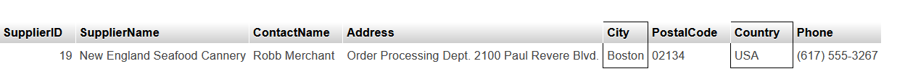

# SQL Learning

1️⃣ [SQL Basics](#sql-basics)

2️⃣ [SQL Advanced](#sql-advanced)


# SQL Basics

1. Wyświetl z tabeli customers kraje bez duplikatów, uporządkuj w kolejności alfabetycznej malejaco, wyświetl tylko 6 pierwszych wyników. 

```sql
SELECT DISTINCT country FROM `customers` ORDER BY Country DESC LIMIT 6; 
```


2. Wyświetl z tabeli Customers takie kontakty, których ContactName zaczyna się od dowolnej literki, druga to "a", trzecia "r"i ma kończyć się na "s". Wyswietl tylko nazwisko i Id klienta. 

```sql
SELECT ContactName, CustomerID FROM customers WHERE ContactName LIKE '_ar%s'; 
```


 3. Dla tabeli customers stwórz zapytanie, które wyświetli wszystkie osoby mieszkające w Madrycie lub we Francji. 

```sql
SELECT * FROM `customers` WHERE City = "Madrid" OR Country = "France"; 
```


4. Dla tabeli Orders zrób zapytanie, które wyświietli tylko 2 pierwsze rekordy należące do przedziału dat: 
od 1996-07-15 do 1996-07-30. Posortuj wyniki rosnąco po kolumnie ShipperId i malejąco po OrderId. 

```sql
SELECT * FROM `orders`WHERE OrderDate BETWEEN '1996-07-15' AND '1996-07-30' ORDER BY ShipperID ASC, OrderID DESC LIMIT 2; 
```


5. Dla klienta o Id=5 zaktualizuj miasto i kraj na odpowiednio Warszawa, Polska. 

```sql
UPDATE customers SET City = "Warsaw", Country = "Poland"
WHERE CustomerID = 5;
```


6.  Zrób zestawienie łącznej ilości osób dla konkretnej narodowości. Wyświetl tylko te rekordy gdzie łączna ilość osób w kraju > 2. Możesz wyświetlić rekordy malejąco. 

```sql
SELECT CustomerID, COUNT(CustomerName) AS IloscOsob, Country  FROM customers
GROUP By Country
HAVING COUNT(CustomerName)>2
ORDER BY COUNT(CustomerName) DESC;
```


7. Dla tabeli Suppliers przygotuj zestawienie, które pogrupuje łączną ilość osób należących do konkretnego Country. Uporządkuj malejąco. 

```sql
SELECT COUNT(SupplierID) AS LacznailoscOsob, Country, SupplierName
FROM `suppliers`
GROUP BY Country
ORDER By COUNT(SupplierID) DESC;
```


8. Z tabeli suppliers wyświetl tylko klientów z USA, którzy mieszkają w Bostonie

```sql
SELECT * FROM suppliers WHERE Country = "USA" AND City = "Boston"; 
```


9. Wypisz z tabeli shippers tylko tych dostawców, którzy podali numer telefonu

```sql
SELECT * FROM `shippers`where Phone IS NOT NULL; 
```


```sql
SELECT * FROM suppliers
```


10.  Wyświetl z tabeli ReceiptProduct nazwę, id i cenę produktu, który ma najwyższą cenę z produktów z tabeli. 

```sql
SELECT name, receiptid, unitprice FROM ReceiptProduct WHERE unitprice IN (SELECT MAX(unitprice)FROM ReceiptProduct)
```


11. Policz ile klient o Id=1 łącznie wydał na zakupy w sklepie internetowym. 

```sql
SELECT SUM(Price) FROM products WHERE SupplierID = 1;
```


# SQL Advanced

1.  Z tabeli shippers wypisz nazwę dostawcy i numer telefonu, jeśli nie będzie podanego numeru telefonu wyświetl "brak numeru"

```sql
SELECT ShipperName, COALESCE(Phone, "brak numeru")AS Phone FROM `shippers`; 
```


2. Z tabeli orders wyświetl Id i datę zamówienia. Datę przekształć z typu "date"-->"datatime"

```sql
SELECT OrderID, CAST(OrderDate AS DATETIME) AS OrderDate FROM `orders`; 
```


3. Z tabeli orders wyświetl Id i datę zamówienia. Datę przekształć z typu "date"-->"datatime"

```sql
SELECT OrderID, CAST(OrderDate AS DATETIME) AS OrderDate FROM `orders`; 
```


4. Połącz kolumny imię i nazwisko w jedną z tabeli employees i nazwij "pracownik". 

```sql
SELECT CONCAT(FirstName, " ", LastName)AS pracownik FROM `employees`; 
```


5. Stwórz zestawienie na podstawie tabeli orders które będzie sprawdzało czy zamówienia są z przedziału od 12 lipca 1996, oznacz takie jako nowe. W przecwinym razie wyświetl mi, że zamówienie jest stare. Jeśli zamówienie jest z dnia 12.07.1996 - przyjmijmy, że to dzisiejsze zamówienie. 

```sql
 SELECT OrderID, OrderDate, CASE WHEN OrderDate > '1996-07-12' THEN "Nowe zamowienie" WHEN OrderDate = '1996-07-12' THEN "Dzisiejsze zamowienie" ELSE "Stare zamowienie" END AS informacjaOZamowieniu FROM `orders`; 
```


6. Zwróć country z tabeli customers i z tabeli suppliers. 

```sql
SELECT Country FROM `suppliers`
UNION 
SELECT Country FROM customers;
```


7. 

